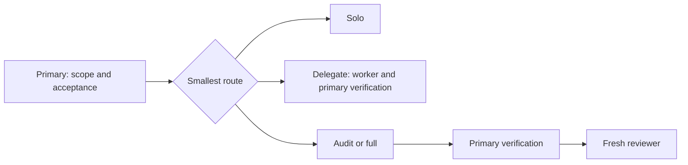

# Codex Delivery Workflow

This is a small, portable reference for planning and reviewing Codex work. It extracts the useful parts of a personal setup into an inspectable repository; it is not a distributed runtime or a copy of that private configuration.

It is for developers who want a clear handoff between a primary Codex session, a bounded implementation role, and an independent review role. Native Codex performs the execution. This repository does not synchronize memory across tasks, guarantee a model is available, or make a claim about token or performance savings.

## Route the work

Choose the smallest sufficient route. Keep requirements, architecture, scope decisions, and final acceptance with the primary session.

| Route | Use it when | Ownership |
| --- | --- | --- |
| `solo` | The scope is known and small. | Primary plans, changes, verifies, and self-reviews. |
| `delegate` | One bounded implementation or research task reduces primary work. | Delegate owns the packet; primary continues useful non-duplicate work and verifies the result. |
| `audit` | The primary completed a material-risk change or independent review is requested. | Primary implements and verifies; a fresh reviewer inspects the fixed result. |
| `full` | The work is broad or high-risk. | Worker implements a bounded area; primary verifies; a fresh reviewer reviews the finished result. |



Do not delegate work merely to restate what the primary already knows. When delegates are useful, assign non-overlapping files or questions, retain useful primary work, and count the primary session in the runtime concurrency limit. The available slot count is runtime state, not a permanent setting in this workflow.

Each packet states the exact owned scope, preserved interfaces, constraints, existing authorization, and concrete verification. A request to make a change does not reveal the sandbox that actually ran it: record requested permissions separately from observed sandbox or permission metadata.

For `audit` and `full`, review a fixed change range or exact artifact hashes. The reviewer performs two independent passes:

- **Standards** asks whether the change is correct, safe, maintainable, and adequately verified.
- **Spec** asks whether the approved requirements were met without unauthorized scope.

A reviewer never fixes files. If an implementation change follows review, the primary re-verifies and a new reviewer reviews the revised fixed point. The previous verdict is no longer current. A fresh reviewer gives fresh-context independence; it does not prove independence between model families.

## Roles supplied here

The original, short role profiles are [`delivery_worker.toml`](agents/delivery_worker.toml) and [`delivery_reviewer.toml`](agents/delivery_reviewer.toml). Both request `gpt-5.6-terra` with `high` reasoning. The worker requests `workspace-write`; the reviewer requests `read-only`.

The recommended primary preference from the source setup is `gpt-6-astra` with `medium` reasoning. Preserve a model explicitly selected for the current task, and respect actual account and runtime availability. A TOML file is static configuration evidence; it does not prove that a role was discovered, selected, or enforced at runtime. In particular, a reviewer is read-only only when the observed runtime sandbox metadata confirms it.

For native invocation, dispatch `delivery_worker` for a bounded `delegate` or `full` packet and `delivery_reviewer` for `audit` or `full` after primary verification. Before dispatch, check exposed role availability and that its metadata matches Terra/high. If the role is absent or conflicts, stop that lane and report the mismatch; do not silently substitute another role. Dispatch a reviewer with `fork_turns: none` and no model or reasoning override so it receives fresh context. No per-spawn model or reasoning override is needed for these pinned roles. Do not infer that installing this reference disables plugins, skills, or any other configuration.

## Install manually (opt in)

The installed skill is self-contained: copying only `skills/codex-delivery-workflow` remains functional. The examples are repository companions, not required runtime files.

From a local clone, set `$repo` to its path. The following PowerShell commands refuse to overwrite the three destination paths.

```powershell
$repo = '<path-to-local-clone>'
$codexHome = Join-Path $HOME '.codex'
$skillSource = Join-Path $repo 'skills\codex-delivery-workflow'
$skillDestination = Join-Path $codexHome 'skills\codex-delivery-workflow'
$agentsDestination = Join-Path $codexHome 'agents'

if ((Test-Path -LiteralPath $skillDestination) -or
    (Test-Path -LiteralPath (Join-Path $agentsDestination 'delivery_worker.toml')) -or
    (Test-Path -LiteralPath (Join-Path $agentsDestination 'delivery_reviewer.toml'))) {
    throw 'Installation stopped: a destination already exists.'
}

New-Item -ItemType Directory -Force -Path (Join-Path $codexHome 'skills'), $agentsDestination | Out-Null
Copy-Item -Recurse -LiteralPath $skillSource -Destination $skillDestination
Copy-Item -LiteralPath (Join-Path $repo 'agents\delivery_worker.toml') -Destination $agentsDestination
Copy-Item -LiteralPath (Join-Path $repo 'agents\delivery_reviewer.toml') -Destination $agentsDestination
```

On POSIX systems, use the same opt-in check and copy paths under `~/.codex`:

```sh
repo='/path/to/codex-delivery-workflow'
skill_destination="$HOME/.codex/skills/codex-delivery-workflow"
worker_destination="$HOME/.codex/agents/delivery_worker.toml"
reviewer_destination="$HOME/.codex/agents/delivery_reviewer.toml"

if [ -e "$skill_destination" ] || [ -e "$worker_destination" ] || [ -e "$reviewer_destination" ]; then
  printf '%s\n' 'Installation stopped: a destination already exists.' >&2
  exit 1
fi

mkdir -p "$HOME/.codex/skills" "$HOME/.codex/agents"
cp -R "$repo/skills/codex-delivery-workflow" "$skill_destination"
cp "$repo/agents/delivery_worker.toml" "$worker_destination"
cp "$repo/agents/delivery_reviewer.toml" "$reviewer_destination"
```

Reopen Codex after installing. Then verify that the skill and roles are discovered in a fresh session and inspect that session's exposed role/model/sandbox metadata before describing any behavior as runtime-observed.

## Fictional packet flow

The [worker packet](examples/task-packet.md) and [review packet](examples/review-packet.md) illustrate an idempotency fix for a fictional order-submission API. They are example prompts only, not a record of a customer incident, a past execution, or a test result.

Neither packet authorizes a commit, merge, push, release, or deployment. Those actions require their own authorization and evidence.

## Static validation

Run the repository validator with Python 3.11 or newer:

```powershell
python -X utf8 scripts/validate.py
```

It checks the expected file set, skill frontmatter, role TOML fields, repository-local Markdown links, machine-specific source-path markers, and obvious credential-shaped text. It is static validation, not a security guarantee or proof of installed/runtime behavior.

## Attribution

This portable adaptation is informed by [Sol Advisor](https://github.com/DannyMac180/sol-advisor), [VoltAgent's awesome-codex-subagents](https://github.com/VoltAgent/awesome-codex-subagents), and [obra/superpowers](https://github.com/obra/superpowers). See [NOTICE.md](NOTICE.md).
