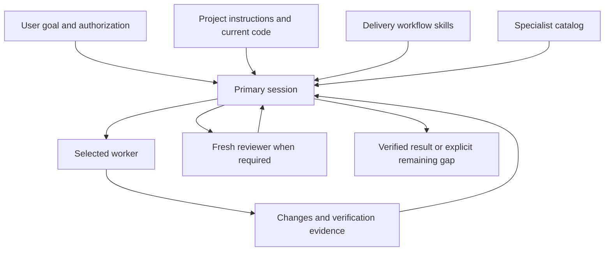

# System architecture

The system combines instructions, role profiles, project evidence, and native tools. A skill does not create an execution environment by itself, and a specialist title does not mean a separately trained model.

## Layers and responsibilities

| Layer | Responsibility | Included here |
| --- | --- | --- |
| User and project instructions | Scope, success criteria, existing authorization, repository rules | Procedures for respecting them; no private project instructions |
| Primary session | Architecture, decomposition, route, integration, final acceptance | [Routing skill](../../skills/codex-delivery-workflow/SKILL.md) |
| Workflow skills | Planning, scoped execution, parallelism, and review contracts | [Six-skill pack](workflows.md) |
| Specialist profiles | Role-specific focus, model/effort preference, requested sandbox | [Catalog](../../agents/catalog.json) and two starter roles |
| Native tools | Read/edit files, execute checks, browse, inspect Git/CI, coordinate agents | Tool-use boundaries, not a bundled server or credentials |
| Evidence | Diffs, test results, runtime observations, release/deploy identity | [Evidence examples](../guides/worked-examples.md) |
| Recall and handoff | Relevant prior decisions and task continuity | [Context rules](context-and-handoffs.md), no shared-memory service |

## What the primary retains

The primary resolves ambiguity that changes the outcome, settles interfaces before splitting work, and chooses the smallest sufficient route. It does not hand architecture ownership to several workers simultaneously. It inspects the actual diff, verifies behavior proportionally to risk, and treats an agent report as a claim until supported.

The primary also owns authorization boundaries. A reviewer saying `ship` establishes readiness within the reviewed scope; it does not grant permission to merge, publish, deploy, or contact someone. Existing explicit authorization continues to apply without repetitive confirmation.

## Tools are capabilities, not agents

A typical run can use filesystem reads, patch tools, a terminal, Git/GitHub, and a browser. A browser verifies visible behavior; a shell can run unit tests; a GitHub connection can inspect CI and a fixed PR. None of those tools independently proves end-to-end success.

MCP servers and plugins add capabilities only when connected and authorized. A profile named `devops-engineer` does not bring credentials or a production host connection. A local tool result must not be presented as a production check.

## Isolation and concurrency

Workers may share the same checkout. Role separation alone does not isolate files, ports, databases, or services. Set ownership explicitly, sequence dependent tasks, and use worktrees or separate resources when the task needs actual isolation.

A reviewer profile requests a read-only sandbox. Record the sandbox actually exposed by the runtime. If hard isolation is required and unavailable, stop that review lane. When a broader policy is explicitly acceptable, require read-only behavior and compare the fixed artifacts before/after review.

## Distribution boundary

The dated 120-role snapshot represents local configuration. The portable `delivery_worker` and `delivery_reviewer` are additional starter examples. Available roles, effective model routing, active skills, and concurrency are runtime facts that must be checked on the receiving host.

The repository does not distribute the author's account configuration, commercial material, personal automations, or private conversation history. Upstream notices are in [NOTICE.md](../../NOTICE.md).
