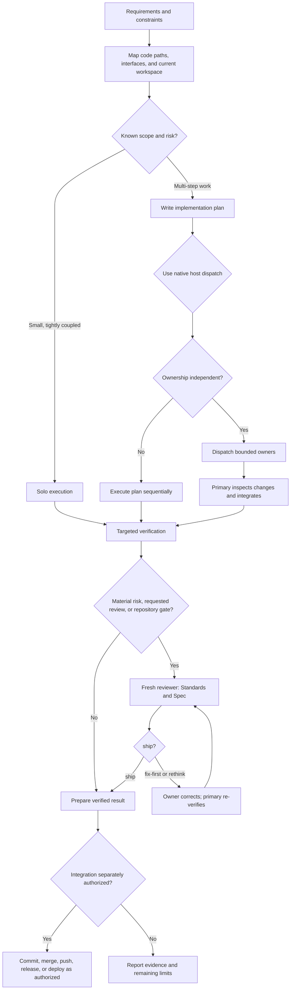

# Delivery workflow architecture

This pack describes a delivery decision flow for a primary Codex or Claude Code session.
The primary keeps requirements, architecture, scope, integration judgment, and
acceptance. Workers own only bounded tasks; reviewers inspect a fixed result and do not
fix it.

| Decision or stage | Included skill | Responsibility |
|---|---|---|
| Route selection and packet contract | [codex-delivery-workflow](../../skills/codex-delivery-workflow/SKILL.md) | Select solo, delegate, audit, or full; keep scope and acceptance with the primary. |
| Multi-step design | [writing-plans](../../skills/writing-plans/SKILL.md) | Make file ownership, interfaces, commands, and acceptance checks executable. |
| Tightly coupled execution | [executing-plans](../../skills/executing-plans/SKILL.md) | Execute the approved plan with targeted evidence. |
| Specialist ownership | [subagent-driven-development](../../skills/subagent-driven-development/SKILL.md) | Send a complete bounded packet and inspect the returned diff and tests. |
| Independent concurrency | [dispatching-parallel-agents](../../skills/dispatching-parallel-agents/SKILL.md) | Run only ownership-independent work and integrate it deliberately. |
| Fixed-point review | [requesting-code-review](../../skills/requesting-code-review/SKILL.md) | Keep Standards and Spec as separate passes and return a clear verdict. |

| Host | Dispatch rule | Review rule |
| --- | --- | --- |
| Codex | Select a runtime-available Codex role; use the starter `delivery_worker` when applicable. Its configured `gpt-5.6-terra` / `high` metadata stays pinned. | Use `delivery_reviewer` in fresh context with `fork_turns: none`; do not add model or effort overrides. |
| Claude Code | Select a native `Agent` with a generated normalized `subagent_type`; use `delivery-worker` when applicable. Keep the user's selected Anthropic primary model and use account-available aliases. | Use a fresh native `delivery-reviewer` subagent, not a parent fork. The reviewer has only `Read`, `Grep`, and `Glob`; the primary provides test and external-check output. |

The starter pack names Codex `delivery_worker` and `delivery_reviewer`, and Claude Code
`delivery-worker` and `delivery-reviewer`. A broader installed catalog can select a
runtime-available specialist such as `code-mapper` for a bounded
execution map, `backend-developer` or `fullstack-developer` for implementation,
`react-specialist` or `angular-architect` for UI work, `debugger` for a bounded
root-cause investigation, and `test-automator` only for independent test ownership.
Do not select a role merely because it appears in a catalog. A saved profile or catalog
snapshot is configuration, not proof that the role is available, routed, or running.

Installing sibling folders does not guarantee global synchronization with local skills,
plugins, configuration, or a role catalog. Runtime availability, model metadata,
permissions, and isolation must be checked in the active environment. Claude aliases
describe a runtime version available to the account; they are not a promise of a fixed
model ID, equivalent intelligence, or equivalent pricing. The workflow never overrides
higher-priority instructions or grants integration authority. See the [Claude Code
guide](../guides/claude-code.md) for the local adapter and `@AGENTS.md` import setup.

Attribution for exported workflow sources is retained in the repository
[NOTICE](../../NOTICE.md).
